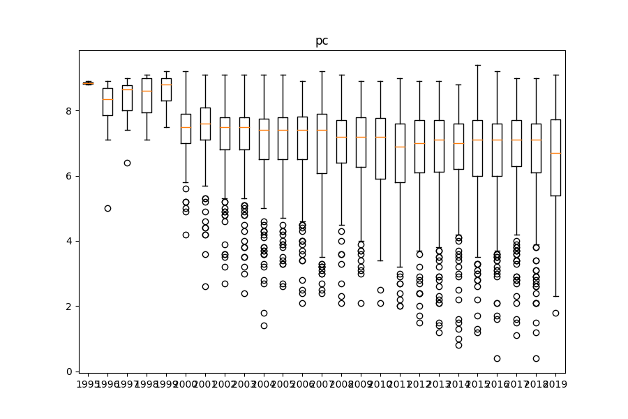
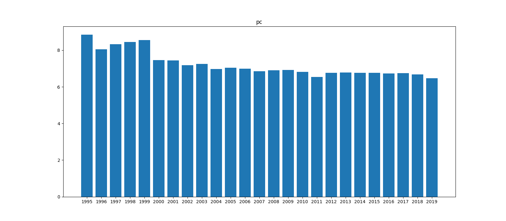

# Metacritic score over time
A small python script to get statistics related to metacritic scores for video games over the years.

## Description
The program works in the following way:

- It first finds out how many pages, for a specific year, on a specific platform, that there are.
- After this, it finds all scores on that page, and continues to the next page if there is one.
- Then it plots the data and displays a boxplot graph and a regular graph of the data.

The metacritic site is slow at returning a request, so execution of the program takes a while.

## Background
I was glancing over the metacritic score for PC games for 2018, and noticed the large amount of average negative user reviews. I thought nothing of it, and continued to look at the metacritic scores for earlier years. I noticed a trend that the earlier I went in time, the more positive user reviews I saw. I wondered if there was any merit to this observation. So I made this small Python script to see for myself.

## Installing requirements
This project requries python 3.

Requirements for this script are installed via Pip.

```sh
pip3 install -r requirements.txt
```

## Running the script

### Arguments that the program accepts
The first argument the program accepts is a space-separated list of years, ie: `1995 1996 1997 1998 1999`.

The second argument the program accepts is the platform it should get data for. The platform can be **one** of: `all, pc, ps4, xboxone, switch, wii-u, 3ds, vita, ios`.

To run the script, do:
```sh
python3 average_pc_scores_over_years.py -y {space-separated list of years} -p {one of the available platforms}
```

Once the graphs pop up, you can view them and save them if you wish. Close the graph windows and then press CTRL+D to halt the program.

### Examples

If you want all data for the WiiU platform from 2012-2013:

`python3 average_pc_scores_over_years.py -y 2012 2013 -p wii-u`

If you want all data for the PS4 platform from 2013-2018:

`python3 average_pc_scores_over_years.py -y 2012 2013 2014 2015 2016 2017 2018 -p ps4`

If you want all data for the PC platform from 1995-2019:

`python3 average_pc_scores_over_years.py -y 1995 1996 1997 1998 1999 2000 2001 2002 2003 2004 2005 2006 2007 2008 2009 2010 2011 2012 2013 2014 2015 2016 2017 2018 2019 -p pc`

## Conclusion
Upon seeing the data, I was genuinely surprised. I didn't think there would be any corrolation, but it turns out there is. See the data below:





There is a clear tendency for more negative reviews in the more current years. What is the reason for this? Nostalgia? Are games getting worse over time? Are we getting more critical? More cynical? Are corporations pushing out the least-effort games?

Who knows. There are a lot of factors at play here.

## TODO

Look at the total number of user reviews for each game. Maybe more valuable data can be gathered.
